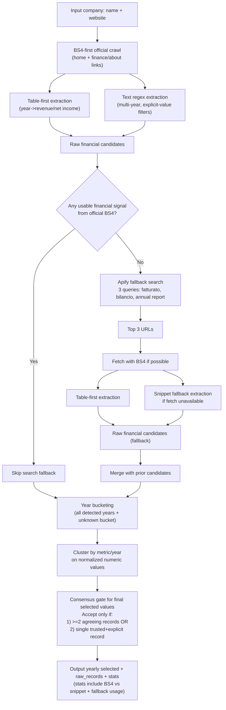

# Financial Extraction Flowchart

```mermaid
flowchart TD
    A["Input company: name + website"] --> B["BS4-first official crawl<br/>(home + finance/about links)"]
    B --> C["Table-first extraction<br/>(year->revenue/net income)"]
    B --> D["Text regex extraction<br/>(multi-year, explicit-value filters)"]
    C --> E["Raw financial candidates"]
    D --> E

    E --> F{"Any usable financial signal<br/>from official BS4?"}
    F -- Yes --> G["Skip search fallback"]
    F -- No --> H["Apify fallback search<br/>3 queries: fatturato, bilancio, annual report"]
    H --> I["Top 3 URLs"]
    I --> J["Fetch with BS4 if possible"]
    J --> K["Table-first extraction"]
    J --> L["Snippet fallback extraction<br/>if fetch unavailable"]
    K --> M["Raw financial candidates (fallback)"]
    L --> M
    M --> N["Merge with prior candidates"]

    G --> O["Year bucketing<br/>(all detected years + unknown bucket)"]
    N --> O

    O --> P["Cluster by metric/year<br/>on normalized numeric values"]
    P --> Q["Consensus gate for final selected values<br/>Accept only if:<br/>1) >=2 agreeing records OR<br/>2) single trusted+explicit record"]
    Q --> R["Output yearly selected + raw_records + stats<br/>(stats include BS4 vs snippet + fallback usage)"]
```

